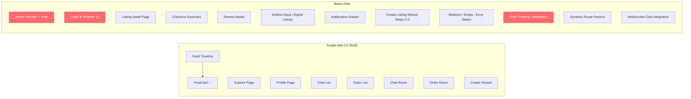

# Sotto — Eksplorasi Menyeluruh & Rencana Pengembangan Frontend

## 1. Visi Project

Sotto = **inkubator digital + gig marketplace** khusus siswa. 3 pilar:

| Pilar | Deskripsi | Domain Frontend |
|-------|-----------|-----------------|
| **Panggung Pameran** | Feed portofolio, profil publik, trust score | `feed/`, `profile/` |
| **Pasar Keahlian** | Listing jasa + produk digital, order, escrow, review | `listings/`, `orders/` |
| **Ruang Negosiasi** | Chat kontekstual, custom offer, checkout | `chat/`, `negotiations` |

---

## 2. Tech Stack Aktual

### Backend (NestJS — **matang**)
- **NestJS** + GraphQL (Apollo Server v5) + Prisma (PostgreSQL)
- **16 modul bisnis**: iam, accounts, feed, synergy, synergy-worker, analytics, search, listings, orders, payments, negotiations, chat, notifications, media, tags, schools
- **Infra**: ScyllaDB (chat/feed), Redis (cache/queue), MinIO (object storage), BullMQ
- **GraphQL schema**: 333 baris, 23 mutations, 20 queries → **sangat lengkap**
- **Codegen hooks**: `generated.ts` (1222 baris) sudah tersedia → hooks siap pakai

### Frontend (React Router v7 + Vite — **masih awal**)
- React 19 + RRv7 (framework mode) + Tailwind v4 + Apollo Client v4
- `framer-motion` terpasang tapi **belum digunakan**
- `lucide-react` utk icon, `clsx` + `tailwind-merge` utk `cn()`
- Codegen sudah generate hooks: `useGetFeedQuery`, `useCreatePostMutation`, `useGetListingsQuery`, dll

---

## 3. Status Implementasi Frontend

### Komponen UI (`components/`)

| File | Status | Catatan |
|------|--------|---------|
| `ui/Avatar.tsx` | ✅ Selesai | Size variants, fallback |
| `ui/Badge.tsx` | ✅ Selesai | 6 variants |
| `ui/Button.tsx` | ✅ Selesai | 5 variants, 4 sizes, `forwardRef` |
| `layout/TopHeader.tsx` | ✅ Selesai | Logo, search, bell, dark toggle |
| `layout/BottomNav.tsx` | ✅ Selesai | 5 item, active state, badge |
| `layout/DesktopSidebar.tsx` | ✅ Selesai | Responsive md+ sidebar |
| `layout/Button.tsx` | ❌ Kosong | 0 bytes — **dead file** |
| `layout/Modal.tsx` | ❌ Kosong | 0 bytes — **dead file** |
| `layout/Skeleton.tsx` | ❌ Kosong | 0 bytes — **dead file** |
| `ui/BottomNavbar.tsx` | ❌ Kosong | 0 bytes — **duplikat dead file** |
| `ui/TopHeader.tsx` | ❌ Kosong | 0 bytes — **duplikat dead file** |

### Feature Components (`features/`)

| Feature | File | Status |
|---------|------|--------|
| `feed/components/PostCard.tsx` | ✅ Selesai | Lengkap: header, body, tags, media, attachment, actions |
| `auth/*` | ❌ Kosong | Folder ada, 0 file |
| `chat/*` | ❌ Kosong | Folder ada, 0 file |
| `listings/*` | ❌ Kosong | Folder ada, 0 file (bahkan tak ada `components/`) |
| `orders/*` | ❌ Kosong | Folder ada, 0 file |
| `profile/*` | ❌ Kosong | Folder ada, 0 file |

### Routes (Halaman)

| Route | LOC | Status |
|-------|-----|--------|
| `_main.tsx` | 54 | ✅ Layout (sidebar + header + bottom nav) |
| `_main._index.tsx` | 82 | ⚠️ Mock data, FAB, belum GraphQL |
| `_main.explore.tsx` | 90 | ⚠️ Mock data, search + categories + talent grid |
| `_main.profile.tsx` | 240 | ⚠️ Mock data, hero + tabs (penawaran/pengalaman) |
| `_main.chats.tsx` | 89 | ⚠️ Mock data, chat list |
| `_main.orders.tsx` | 120 | ⚠️ Mock data, order cards + status |
| `workspace.chat.tsx` | 126 | ⚠️ Mock data, contextual banner, custom offer card |
| `workspace.create.tsx` | 122 | ⚠️ Mock data, wizard type selector + portfolio form |
| `workspace.order.tsx` | 118 | ⚠️ Mock data, progress tracker, review actions |
| `login.tsx` | 4 | ❌ Placeholder |
| `register.tsx` | 4 | ❌ Placeholder |

### Core Infrastructure

| Item | Status |
|------|--------|
| `apollo/base-types.ts` | ✅ Generated, 548 baris |
| `apollo/generated.ts` | ✅ Generated, 1222 baris — semua hooks |
| `core/utils/cn.ts` | ✅ |
| Apollo Client config (`ApolloProvider`) | ❌ **TIDAK ADA** |
| Auth store (Zustand) | ❌ **TIDAK ADA** |
| Theme store | ❌ **TIDAK ADA** (inline di `_main.tsx`) |
| Constants (ROUTES, etc) | ❌ **TIDAK ADA** |
| Custom hooks | ❌ **TIDAK ADA** |

---

## 4. Evaluasi Kualitas Kode Frontend

### ✅ Positif

1. **Struktur folder** — ikut ref arsitektur dgn baik: `features/`, `components/ui|layout/`, `core/`, `routes/`
2. **UI komponen atomik** — `Avatar`, `Badge`, `Button` well-typed, variant-based, pakai `cn()`
3. **Responsive design** — ada `DesktopSidebar` (md+) + `BottomNav` (mobile), layout adaptif
4. **Dark mode** — sudah impl dgn `dark:` prefix + localStorage + FOUC prevention script
5. **PostCard** — pattern solid: props interface, decomposed sections, lazy loading gambar
6. **Route structure** — layout route `_main.tsx` membungkus correctly, workspace routes terpisah
7. **Codegen pipeline** — `@graphql-codegen/cli` sudah setup dgn `typescript-react-apollo`
8. **Dependency rule** — `features/` impor dari `components/`, bukan sebaliknya ✅

### ⚠️ Masalah Arsitektural

1. **ZERO koneksi ke backend** — semua data mock, tak ada `ApolloProvider`, tak ada `.graphql` file di `features/*/api/`
2. **Auth flow kosong total** — tak ada guard, tak ada token management, login/register = placeholder
3. **Theme logic bocor ke route** — `isDark` + `toggleTheme` hidup di `_main.tsx` bukan global store
4. **Duplikat dead files** — 5 file 0-byte (`layout/Button.tsx`, `layout/Modal.tsx`, `layout/Skeleton.tsx`, `ui/BottomNavbar.tsx`, `ui/TopHeader.tsx`). Noise, harus dibersihkan
5. **Business logic di route files** — `_main.profile.tsx` (240 LOC) harusnya di `features/profile/`. Route = lem tipis, bukan impl penuh
6. **Workspace routes tanpa dynamic params** — `/workspace/chat` dan `/workspace/order` hardcoded, harusnya `/workspace/chat/:conversationId`, `/workspace/order/:orderId`
7. **Tak ada Zustand** — padahal di `package.json` juga belum diinstall. Ref arsitektur minta `useAuthStore.ts`, `useThemeStore.ts`
8. **Tak ada loading/error states** — ref user-flow tegas minta Skeleton loaders, empty states, toast. Belum ada satupun
9. **Tak ada `framer-motion` usage** — sudah install tapi zero animations
10. **`hide-scrollbar` CSS class** — dipakai di explore tapi tidak didefinisikan di `app.css`

### ⚠️ Masalah Kode

1. Beberapa route pakai template literal (`\`...\``) utk conditional class → harusnya `cn()` utk konsistensi
2. `_main.profile.tsx` Line 166 pakai `hidden sm:flex` di `div` — CSS conflict, harusnya `sm:flex hidden`
3. Chat route back button → ke `/` bukan `/chats` — UX salah
4. Order route back button → ke `/` bukan `/orders` — UX salah
5. `workspace.create.tsx` hanya handle `"portfolio"` type, `"penawaran"` dan `"pengalaman"` belum impl

---

## 5. Gap Analysis: Ref vs Implementasi

---

## 6. Rencana Pengembangan (Prioritized)

### Fase 0: Foundation Fix (WAJIB DULUAN)

> [!CAUTION]
> Tanpa fase ini, semua UI = dekorasi mati. Tidak bisa test apapun.

| # | Task | Effort |
|---|------|--------|
| 0.1 | Install Zustand, buat `useAuthStore.ts` (token, user, login/logout actions) | S |
| 0.2 | Buat `ApolloProvider` wrapper dgn auth header injection | S |
| 0.3 | Wire `ApolloProvider` ke `root.tsx` | XS |
| 0.4 | Buat `useThemeStore.ts`, refactor dark mode dari `_main.tsx` | S |
| 0.5 | Hapus 5 dead files | XS |
| 0.6 | Fix route params: `/workspace/chat/:conversationId`, `/workspace/order/:orderId`, `/profile/:username`, `/listing/:id` | M |
| 0.7 | Definisi `ROUTES.ts` constants | XS |
| 0.8 | Tambah `hide-scrollbar` utility ke `app.css` | XS |

### Fase 1: Auth Flow (Kritis — Gerbang Masuk)

| # | Task | Effort |
|---|------|--------|
| 1.1 | `LoginForm.tsx` — email + password, integrasi REST `/iam/login` | M |
| 1.2 | `RegisterWizard.tsx` — multi-step: akun → sekolah → jurusan → avatar | L |
| 1.3 | Auth guard: redirect ke `/login` jika belum auth | S |
| 1.4 | Persist token ke localStorage, auto-refresh | S |

### Fase 2: Feed — Koneksi ke Backend

| # | Task | Effort |
|---|------|--------|
| 2.1 | Wire `_main._index.tsx` ke `useGetFeedQuery` dari generated hooks | M |
| 2.2 | Refactor `PostCard` props → match `PostModel` dari GraphQL | S |
| 2.3 | Buat `features/feed/api/feed.graphql` (sudah ada di generated, tapi perlu `.graphql` src files) | S |
| 2.4 | Implementasi infinite scroll via cursor pagination | M |
| 2.5 | Tambah Skeleton loader utk feed | S |
| 2.6 | Empty state SVG + copy utk feed kosong | S |

### Fase 3: Profile — Koneksi ke Backend

| # | Task | Effort |
|---|------|--------|
| 3.1 | Pindahkan 240 LOC dari `_main.profile.tsx` → `features/profile/components/` | M |
| 3.2 | Wire ke `useGetMyProfileQuery` dan `useGetUserProfileQuery` | M |
| 3.3 | Wire listings tab ke `useGetListingsByAccountQuery` | S |
| 3.4 | Implementasi follow/unfollow mutation | S |
| 3.5 | Avatar upload ke MinIO via `requestUploadUrl` | M |

### Fase 4: Listing Detail (Halaman Baru — KRUSIAL)

> [!IMPORTANT]
> Halaman ini belum ada sama sekali. Ini jembatan antara browsing → transaksi.

| # | Task | Effort |
|---|------|--------|
| 4.1 | Buat route `/listing/:id` | XS |
| 4.2 | `ListingDetailPage.tsx` — image slider, desc, harga, sticky CTA | L |
| 4.3 | Branching UI: Jasa → "Chat Penjual" / Produk Digital → "Beli & Unduh" | M |
| 4.4 | Wire ke `useGetListingDetailQuery` | S |

### Fase 5: Create Wizard — Penyelesaian

| # | Task | Effort |
|---|------|--------|
| 5.1 | Portfolio upload: wire ke `requestUploadUrl` + `confirmUpload` + `createPost` | L |
| 5.2 | Listing wizard step 2-3: harga, kapasitas, deskripsi, galeri (branching jasa/produk) | L |
| 5.3 | Tag autocomplete: wire ke `useSearchTagsQuery` | M |
| 5.4 | Pengalaman form (opsional, bisa di-defer) | S |

### Fase 6: Chat — Real-time Integration

| # | Task | Effort |
|---|------|--------|
| 6.1 | Wire chat list ke `useGetConversationsQuery` | M |
| 6.2 | Wire chat room ke `useGetMessagesQuery` + Socket.io | L |
| 6.3 | Implementasi send message via WebSocket | M |
| 6.4 | Custom offer creation (seller-side) | M |
| 6.5 | Accept/Reject offer (buyer-side) → wire mutations | S |

### Fase 7: Orders & Checkout

| # | Task | Effort |
|---|------|--------|
| 7.1 | Wire order list ke `useGetMyOrdersQuery` | M |
| 7.2 | Wire order detail ke `useGetOrderDetailQuery` + dynamic status | M |
| 7.3 | `CheckoutSummary.tsx` — order breakdown, security badge, payment CTA | L |
| 7.4 | `ReviewModal.tsx` — star rating, comment, wire `createReview` | M |
| 7.5 | Order status advance/cancel mutations | S |

### Fase 8: Digital Library & Polish

| # | Task | Effort |
|---|------|--------|
| 8.1 | "Koleksi Saya" tab di profil — purchased digital products | M |
| 8.2 | Download via presigned URL | S |
| 8.3 | Notification drawer — wire `useGetNotificationsQuery` | M |
| 8.4 | Toast notification system (sonner atau custom) | M |
| 8.5 | Framer Motion animations: page transitions, card hover, FAB | M |
| 8.6 | Search/Explore: wire ke `searchListings` + `searchAccounts` | L |

---

## 7. Ringkasan

**Backend = ~80% siap** (16 modul, full GraphQL schema, auth, escrow, WebSocket).

**Frontend = ~15% siap** (UI shells dgn mock data, zero backend integration).

Prioritas utama: **Fase 0 + 1** (foundation + auth). Tanpa ini, semua route = dead UI.

Kualitas kode existing **baik secara visual** — konsisten Tailwind, proper typing, responsive design. Masalah utama: **arsitektur belum matang** (tak ada state management, tak ada API layer, business logic bocor ke routes).
